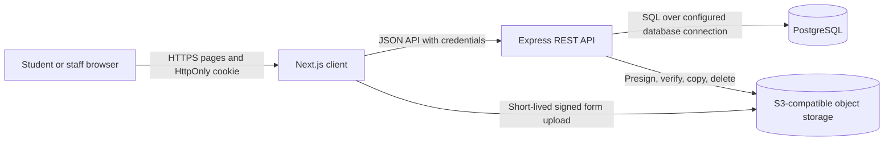
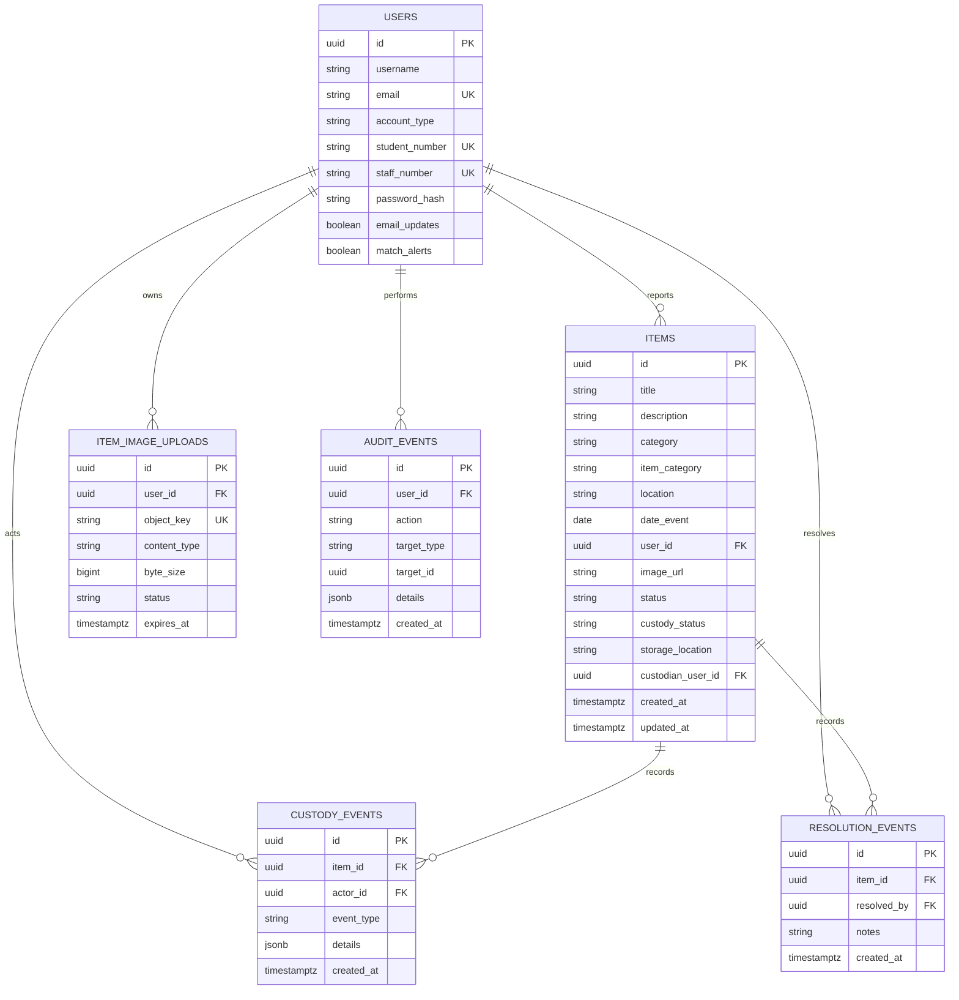

# CampusLink System Documentation

**Project:** CS Campus Lost and Found Board  
**Product name:** CampusLink  
**Document type:** As-built system documentation  
**Document date:** 9 October 2026  
**Status:** Prepared from repository evidence; deployment-specific settings require operator confirmation  
**Audience:** Campus stakeholders, students, security staff, developers, and deployment operators

> This document describes the implementation represented by the repository on the document date. It is not a claim that every production integration is configured or independently verified. Repository references identify the evidence used for implementation statements.

## Contents

1. [Executive Summary](#1-executive-summary)
2. [Scope and Requirements](#2-scope-and-requirements)
3. [Users and Permissions](#3-users-and-permissions)
4. [Architecture](#4-architecture)
5. [Technology and Repository](#5-technology-and-repository)
6. [Functional Workflows](#6-functional-workflows)
7. [REST API Reference](#7-rest-api-reference)
8. [Security and Privacy](#8-security-and-privacy)
9. [Data Model](#9-data-model)
10. [Image Storage](#10-image-storage)
11. [Installation and Local Development](#11-installation-and-local-development)
12. [Deployment and Operations](#12-deployment-and-operations)
13. [Testing and Verification](#13-testing-and-verification)
14. [Limitations and Risks](#14-limitations-and-risks)
15. [Glossary and Appendices](#15-glossary-and-appendices)

## 1. Executive Summary

CampusLink is a campus-focused lost-and-found service intended to give students and campus security a shared place to report, search, and manage lost or found property. Students can create reports, browse and filter listings, and manage their own activity. Staff can record found items into custody, reassign custodians, and release items through a recorded verification workflow. [README.md] [PROJECT_CONTRACT.md] [client/app/page.tsx] [server/routes/item.routes.js]

The system is implemented as a Next.js browser client, an Express REST API, and a PostgreSQL data store. Optional image uploads use a server-generated, short-lived S3-compatible form upload. Authentication uses bcrypt password hashing and a JWT carried by an HttpOnly session cookie for browser requests. [client/package.json] [server/package.json] [server/config/auth.js] [server/services/object-storage.js]

Important operational caveats:

- Image upload requires server-side S3-compatible storage configuration. The source repository does not itself provide a storage bucket or credentials. [server/services/object-storage.js] [DEPLOYMENT_GUIDE.md]
- Notifications and item-match notices are derived in the client from item data; there are no dedicated notification or match records in the schema. [client/app/page.tsx] [server/schema.sql]
- Password-reset email requires a functioning SMTP provider and environment configuration. Successful delivery has not been established by repository inspection alone. [server/utils/email.js]
- Deployment guides describe a Vercel/Render-style split deployment, but provider configuration, production database state, backups, and production smoke checks must be confirmed by the deployment owner. [DEPLOYMENT_GUIDE.md] [RELEASE_CHECKLIST.md]

## 2. Scope and Requirements

### 2.1 Product objectives

The system is intended to:

- Provide campus student and staff registration and sign-in.
- Record lost and found item reports with title, description, category, location, date, and optional image.
- Support browsing, text search, category, status, date, and location filtering.
- Restrict report changes to the owner, with staff-specific custody operations enforced by the API.
- Record custody, reassignment, release, and resolution history.
- Provide student account and contact-preference features. [PROJECT_CONTRACT.md] [server/controllers/item.controller.js] [server/models/item.model.js]

### 2.2 Scope boundaries

| In scope | Out of scope or not established |
|---|---|
| Campus student and staff accounts | External campus identity-provider integration |
| Lost/found reports and report search | Public social-media sharing |
| Server-side ownership and role checks | Delivery or shipping, payments, rewards, or fines |
| Staff custody, reassignment, and release | Facial recognition or automated identity verification |
| Browser-based responsive client and REST API | Native mobile applications |
| Optional S3-compatible image upload | Automatic matching as a persistent backend service |

The exclusions follow the product contract. The table distinguishes product non-goals from integrations that are simply not verified as operational. [PROJECT_CONTRACT.md] [DEPLOYMENT_GUIDE.md]

## 3. Users and Permissions

| Role | Verified capabilities | Restrictions |
|---|---|---|
| Unauthenticated visitor | API item listing/detail routes use optional authentication and can return public item data. The client presents authentication UI when no valid session is found. | Cannot call authenticated report mutations, account routes, uploads, or staff operations. |
| Student | Register and sign in; browse and filter; create reports; update/delete own non-custody reports; resolve own eligible reports; view own resolution history; manage contact preferences. | Cannot manage another user's report or perform staff custody operations. |
| Campus security staff | Staff dashboard; staff item search; create found-item intake; reassign custody to staff; read custody events and audit records; release assigned custody items after completing checks. | Staff authorization is verified by API middleware; release is limited to eligible assigned custody records and requires the documented checks. |

The API enforces staff role and authentication checks in route middleware. Report ownership for creation is derived from the authenticated JWT payload. UI visibility is not the authorization boundary. [server/middleware/auth.middleware.js] [server/routes/item.routes.js] [server/routes/admin.routes.js] [server/controllers/item.controller.js]

## 4. Architecture

### 4.1 Components

| Component | Responsibility |
|---|---|
| Next.js client | App Router pages, sign-in and registration, student and security interfaces, report forms, browser API requests, client-side image compression, and navigation. |
| Express API | Authentication, authorization, validation, rate limiting, item and custody workflows, upload-session management, and JSON error responses. |
| PostgreSQL | Users, items, contact preferences, upload sessions, custody events, audit events, and resolution events. |
| S3-compatible object storage (optional integration) | Holds staged uploads and permanent item image objects when configured. |

### 4.2 Context and trust boundaries



The browser is an untrusted client. Authentication, role checks, ownership checks, item-state transitions, and image verification are API responsibilities. Direct browser upload is limited by a server-issued policy and does not expose storage credentials. [client/app/page.tsx] [server/server.js] [server/middleware/auth.middleware.js] [server/services/object-storage.js]

### 4.3 Application routing

The client uses App Router pages including `/`, `/app`, and `/app/[[...section]]`. The catch-all app page accepts browse, reports, notifications, account, reset-password, and dashboard sections. The client proxy checks the session cookie for `/app/*` and `/reports/*`; dashboard routes also query the API session and route according to the database-backed account type. [client/app/page.tsx] [client/app/app/[[...section]]/page.tsx] [client/proxy.ts]

The API is mounted under `/api/v1` and groups authentication, items, administration, and uploads. [server/server.js]

## 5. Technology and Repository

### 5.1 Verified stack

| Layer | Technology | Evidence |
|---|---|---|
| Web application | Next.js `15.5.27` from the client lockfile; App Router; React `19.2.8` | [client/package-lock.json] [client/package.json] |
| API | Node.js CommonJS application; Express `5.2.1` | [server/package.json] [server/package-lock.json] |
| Database | PostgreSQL through `pg` `8.23.0` | [server/package.json] [server/config/db.js] |
| Authentication | `bcryptjs` `3.0.3`, `jsonwebtoken` `9.0.3` | [server/package-lock.json] [server/controllers/auth.controller.js] |
| Upload integration | AWS SDK S3 client and S3 presigned-post packages | [server/package.json] [server/services/object-storage.js] |
| API middleware | Helmet, CORS, Express rate limit, cookie-parser | [server/package.json] [server/server.js] |

Versions above are lockfile-resolved versions where verified, not a statement that production is running those exact versions. [client/package-lock.json] [server/package-lock.json]

### 5.2 Repository map

| Path | Purpose |
|---|---|
| `client/app/` | Next.js pages, UI, and styles |
| `client/proxy.ts` | Protected-route cookie/session/role checks |
| `client/next.config.ts` | API rewrite configuration |
| `server/server.js`, `server/index.js` | Express app/middleware and API process entry point |
| `server/routes/` | API route registration and middleware binding |
| `server/controllers/` | Request validation and HTTP response handling |
| `server/models/` | PostgreSQL query and transaction logic |
| `server/middleware/` | Authentication, origin, and error middleware |
| `server/services/object-storage.js` | S3-compatible upload signing and object lifecycle |
| `server/schema.sql` | Fresh/current schema initialization |
| `server/migrations/` | Upgrade SQL for existing databases |
| `server/tests/` | Node test-runner tests for API behavior and security |
| `DEPLOYMENT_GUIDE.md` | Environment, migration, deployment, and manual checks |

## 6. Functional Workflows

### 6.1 Registration and sign-in

Registration accepts a username, email, password, confirmation, account type, and student or staff identifier. The email must match the submitted campus identifier and the `@tut4life.ac.za` domain. The API hashes passwords with bcrypt and returns user identity without the hash. Login accepts an email or campus number plus password; success sets the `campuslink_session` HttpOnly cookie. Invalid credentials use a generic response. [server/controllers/auth.controller.js] [server/models/user.model.js]

### 6.2 Session and protected navigation

The client requests `/auth/session` to obtain the current database-backed identity. The browser sends cookies with API requests. The client proxy uses the cookie to ask the API to validate the session and redirects to the correct student or security dashboard based on the returned account type. [client/app/page.tsx] [client/proxy.ts] [server/controllers/auth.controller.js]

### 6.3 Student report lifecycle

Students submit a lost or found report with title, description, item category, location, and date. The API derives `user_id` from the authenticated user, validates required fields and allowed values, and stores the item as active. Owners can update or delete their own non-custody reports. A student may resolve their own eligible report; item updates and resolution history are stored through database operations. [client/app/page.tsx] [server/controllers/item.controller.js] [server/models/item.model.js]

### 6.4 Browse and search

The client requests active or resolved item lists and supplies supported filters. The model uses full-text search for title/description, exact category/item-category/status constraints, inclusive date bounds, and a substring location match. Results are ordered newest first. Public response shaping removes custody and resolution-private fields. [client/app/page.tsx] [server/controllers/item.controller.js] [server/models/item.model.js]

### 6.5 Security custody lifecycle

Staff intake forces category `found`, validates ordinary item fields and requires a non-empty storage location. The API creates the item with `custody_status = in_custody` and the staff member as custodian, then writes an `intake` custody event and an audit event in the same transaction. Reassignment is restricted to an active staff destination and records both a custody event and audit event. Staff release requires all three boolean checks: student ID verified, proof of ownership confirmed, and item condition noted. The item resolution, resolution event, custody release event, and audit event are transactionally recorded. [server/routes/item.routes.js] [server/controllers/item.controller.js] [server/models/item.model.js]

These checklist values are staff attestations; the software does not automatically verify identity or proof of ownership. [PROJECT_CONTRACT.md] [server/controllers/item.controller.js]

### 6.6 Account preferences and notifications

Email and match alert preference values have database columns and authenticated GET/PATCH endpoints. The client also mirrors preferences in local storage and suppresses API update errors; persistence should therefore be confirmed in the target environment. Notifications currently are computed from item data in the client (resolved own items and active found items). They are not persisted as independent notification or match records, and the current “match” text is not evidence of an automated matching engine. [server/schema.sql] [server/routes/auth.routes.js] [server/controllers/auth.controller.js] [client/app/page.tsx]

### 6.7 Password recovery

The API creates expiring reset tokens, sends a reset link through Nodemailer, and accepts a replacement password. SMTP host, port, user, and password are environment configuration; default host settings in source do not prove delivery readiness. The reset token expires after one hour in the current email template/controller flow. [server/controllers/auth.controller.js] [server/models/user.model.js] [server/utils/email.js] [server/migrations/add_reset_token.sql]

## 7. REST API Reference

All paths below are relative to `/api/v1` unless a full path is shown. JSON request bodies are used for API mutations. Exact status codes can also be affected by authentication, rate limiting, validation, and centralized error handling. [server/server.js] [server/routes/auth.routes.js] [server/routes/item.routes.js] [server/routes/admin.routes.js] [server/routes/upload.routes.js]

### 7.1 Authentication

| Method and path | Access | Purpose and verified contract |
|---|---|---|
| `POST /auth/register` | Public | Registers student/staff. Body includes `username`, `email`, `password`, `confirm_password`, `account_type`, and the corresponding `student_number` or `staff_number`. Returns message and safe user identity. |
| `POST /auth/login` | Public; rate limited | Body: `identifier`, `password`. Accepts email or campus number. On success sets HttpOnly `campuslink_session` cookie and returns identity. Invalid credentials return generic `401`. |
| `POST /auth/logout` | Public route | Clears the session cookie and returns a message. |
| `POST /auth/forgot-password` | Public; rate limited | Body: `email`. Returns a non-enumerating message; sends a reset email when the account exists and email service is operational. |
| `POST /auth/reset-password` | Public; rate limited | Body: `token`, `newPassword`. Resets password for a valid unexpired token. |
| `GET /auth/session` | Authenticated | Returns current database-backed user identity; rejects missing/invalid/deleted user sessions. |
| `GET /auth/preferences` | Authenticated | Returns `emailUpdates` and `matchAlerts`. |
| `PATCH /auth/preferences` | Authenticated | Updates the current user's email and match alert booleans. |

Sources: [server/routes/auth.routes.js] [server/controllers/auth.controller.js] [server/models/user.model.js]

### 7.2 Items

| Method and path | Access | Purpose and verified contract |
|---|---|---|
| `GET /items` | Optional authentication | Lists items. Supports `category`, `item_category`, `search`, `status` (`active`, `resolved`, `all`), `date_from`, `date_to`, and `location`. Staff results may include owner/custodian data; public results omit custody and resolution-private fields. |
| `GET /items/:id` | Optional authentication | Returns one item or `404`; response is privacy-shaped for non-staff. |
| `POST /items` | Authenticated | Creates a normal lost/found report. Required values include title, description, category, location, and event date; optional `item_category` and `image_upload_id`. Owner is the authenticated user. Success is `201`. |
| `PATCH /items/:id` | Authenticated owner | Updates allowed report fields or attaches a new image upload; custody items cannot be changed through this owner route. |
| `DELETE /items/:id` | Authenticated owner | Deletes own non-custody item and attempts best-effort owned-image cleanup. |
| `PATCH /items/:id/resolve` | Authenticated owner or eligible staff | Body may contain `notes`. Staff release additionally requires `verification.student_id_verified`, `verification.proof_of_ownership_confirmed`, and `verification.item_condition_noted`, all `true`. |
| `POST /items/intake` | Authenticated staff | Creates a found custody item. Requires ordinary item fields and `storage_location`; optional `dropped_off_by` and `image_upload_id`. Writes custody and audit events atomically. Success is `201`. |
| `PATCH /items/:id/reassign` | Authenticated staff | Body: `user_id` for the target staff member. Reassigns active in-custody item and records events. |
| `GET /items/:id/custody-events` | Authenticated staff | Returns custody event history. |
| `GET /items/:id/resolutions` | Authenticated owner or staff | Returns resolution history; a student cannot read another user's history. |

The server validates categories as `lost`/`found`, item categories as `cards`, `keys`, `phones`, `bags`, `other`, rejects client-managed `image_url`, and validates upload IDs as UUIDs. [server/controllers/item.controller.js] [server/models/item.model.js] [server/routes/item.routes.js]

### 7.3 Uploads and administration

| Method and path | Access | Purpose and verified contract |
|---|---|---|
| `POST /uploads/presign` | Authenticated | Body: `content_type`, `size`. Returns upload ID, expiry, signed URL, and form fields. Requires configured object storage. |
| `DELETE /uploads/:id` | Authenticated upload owner | Cancels an unattached upload and attempts object deletion. |
| `GET /admin/users?q=...` | Authenticated staff | Staff search, minimum two characters; returns up to 20 staff account records matching username/email/staff number. |
| `GET /admin/audit?limit=...` | Authenticated staff | Returns audit rows newest first; default limit 50 and maximum 200. |

Sources: [server/routes/upload.routes.js] [server/controllers/upload.controller.js] [server/routes/admin.routes.js] [server/controllers/admin.controller.js]

### 7.4 Service endpoints

| Method and path | Access | Purpose |
|---|---|---|
| `GET /health` | Public | Process health response. |
| `GET /ready` | Public | Executes `SELECT 1`; returns ready/database-connected or `503` database unavailable. This is connectivity readiness, not a full schema audit. |
| `GET /` | Public | API welcome response and endpoint hints. |

Source: [server/server.js]

## 8. Security and Privacy

### 8.1 Authentication

Passwords are hashed with bcryptjs before storage. JWTs are signed with a server-side `JWT_SECRET`, currently configured for a 24-hour expiry. The browser session uses the `campuslink_session` HttpOnly cookie with SameSite/Secure behavior controlled by server configuration. The API middleware can also accept a Bearer token, but browser requests use credentials and the cookie. Password hashes and JWT signing secrets are not returned as client identity fields. [server/controllers/auth.controller.js] [server/config/auth.js] [server/middleware/auth.middleware.js] [server/controllers/auth.controller.js]

Production startup throws if `JWT_SECRET` is absent. The development fallback secret is not suitable for production. [server/config/auth.js]

### 8.2 Authorization and ownership

The API derives report ownership from `req.user.id`; update/delete operations scope database queries by authenticated user and exclude custody records. Staff middleware checks `accountType === 'staff'`. Staff reassign destinations must themselves be staff accounts. [server/controllers/item.controller.js] [server/models/item.model.js] [server/middleware/auth.middleware.js]

### 8.3 Origin, CORS, and cookies

The API uses Helmet, credentialed CORS, rate limiting for selected authentication routes, and a trusted-origin guard for state-changing methods. Production origins are restricted; wildcard CORS is not appropriate for cookie-authenticated requests. Current origin matching includes the configured allowlist plus CampusLink-specific Vercel stable/preview origins; deployment owners should review that exception against the approved domain policy. Cookies crossing between separate HTTPS hosts require compatible SameSite/Secure settings. [server/server.js] [server/config/deployment.js] [server/middleware/origin.middleware.js] [DEPLOYMENT_GUIDE.md]

### 8.4 Error handling and exposed data

Central error middleware emits generic messages for server errors rather than returning internal exception details. Public item responses omit custody and resolution internals; staff responses may include additional operational data. Never expose environment credentials, password hashes, or provider secrets through logs, API responses, screenshots, or client bundles. [server/middleware/error.middleware.js] [server/controllers/item.controller.js]

## 9. Data Model

The database uses UUID identifiers and PostgreSQL constraints. The table diagram below summarizes relationships verified in the schema and models; migration-added columns are included. [server/schema.sql] [server/migrations/20261007_add_image_uploads_and_custody.sql] [server/migrations/20261009_add_audit_events.sql]



### 9.1 Table summary

| Table | Purpose and important constraints |
|---|---|
| `users` | Account identity, unique email, student/staff account type, unique nullable campus numbers, password hash, and contact-preference booleans. Reset-token columns are added by a migration. |
| `items` | Lost/found report and custody state. `category` is `lost`/`found`; item category is one of the supported taxonomy values; `user_id` references the reporting owner; custody columns identify storage and custodian. |
| `item_image_uploads` | Owner-bound pending/attached/cancelled upload sessions with object key, content type, byte size, and expiry. |
| `custody_events` | Intake, reassignment, and release event history with actor, item, JSON details, and timestamp. |
| `resolution_events` | Item resolution actor, notes, and timestamp. |
| `audit_events` | Staff-action audit actor, action, target, details, and timestamp. |

Search uses generated `search_vector` and GIN indexing; location filtering uses a trigram index when the relevant schema migration has been applied. [server/schema.sql] [server/migrations/add_item_category_and_contact_preferences.sql] [server/migrations/20261007_add_image_uploads_and_custody.sql]

### 9.2 Migration inventory

| Migration | Change |
|---|---|
| `add_reset_token.sql` | Adds user password-reset token and expiry columns. |
| `add_item_category_and_contact_preferences.sql` | Adds item category, user email/match preference fields, constraints, and search/filter indexes. |
| `20261007_add_image_uploads_and_custody.sql` | Adds custody columns, upload-session and custody-event tables, and search/location indexes. |
| `20261009_add_audit_events.sql` | Creates `audit_events` for the intake/reassignment/release audit writes. |
| `20261010_ensure_release_history.sql` | Idempotently ensures `resolution_events`, `custody_events`, and `audit_events` exist for release-history transactions. |

Fresh database setup uses `server/schema.sql`. Existing databases must receive the applicable migrations in a controlled, environment-specific order. No automatic migration runner is defined in the server package scripts. [server/package.json] [DEPLOYMENT_GUIDE.md]

## 10. Image Storage

When an image is selected, the browser compresses it and requests an authenticated presigned upload. The API validates content type and configured maximum size, creates a five-minute upload session, and returns a signed form URL and fields. The browser posts directly to object storage. When the report is created or updated with the upload ID, the server checks session ownership/state/expiry, verifies stored size and content type, reads the file signature, copies the object to a permanent `items/` key, and associates its public URL with the item. [client/app/page.tsx] [server/controllers/upload.controller.js] [server/models/image-upload.model.js] [server/services/object-storage.js]

Supported types are JPEG, PNG, and WebP. The default maximum is 5 MiB; configuration allows a bounded value up to 20 MiB, while the deployment guide documents 5 MiB. The signed upload policy expires after five minutes. Expired unattached sessions should be cleaned by scheduling `npm run cleanup:uploads` at the documented interval. [server/services/object-storage.js] [server/models/image-upload.model.js] [DEPLOYMENT_GUIDE.md]

Required server-only variables are `S3_BUCKET`, `S3_ACCESS_KEY_ID`, `S3_SECRET_ACCESS_KEY`, and `S3_PUBLIC_BASE_URL`; `S3_REGION`, `S3_ENDPOINT`, and `IMAGE_UPLOAD_MAX_BYTES` are optional/configuration-dependent. `S3_PUBLIC_BASE_URL` must be HTTPS in production. Staging objects should remain private; public reads should be restricted to permanent item objects. Actual deployment configuration must be checked before asserting image uploads work. [server/services/object-storage.js] [DEPLOYMENT_GUIDE.md]

If object storage is unavailable, presign returns a safe service-unavailable response. The UI allows a selected optional photo to be removed so the report can be submitted without it. This fallback does not make image persistence available. [server/controllers/upload.controller.js] [client/app/page.tsx]

## 11. Installation and Local Development

### 11.1 Prerequisites

- Node.js compatible with the locked Next.js release.
- npm.
- PostgreSQL with permissions required by `server/schema.sql` and applicable extensions.
- Optional S3-compatible storage for real photo-upload testing.
- Optional SMTP configuration for password-reset email testing. [client/package-lock.json] [server/schema.sql] [server/utils/email.js]

### 11.2 Environment setup

Create an ignored `server/.env` with local-only values. Use placeholders; do not commit secrets:

```dotenv
PORT=3001
DATABASE_URL=postgresql://<user>:<password>@localhost:5432/lost_and_found
JWT_SECRET=<long-random-development-secret>
```

For local client development, `NEXT_PUBLIC_API_BASE_URL` may be set to `http://localhost:3001/api/v1`; `API_SERVER_URL` should point to the API origin for protected-route checks and Next rewrites. Never put database, JWT, email, or storage credentials in `NEXT_PUBLIC_*` variables. [README.md] [DEPLOYMENT_GUIDE.md] [client/next.config.ts] [client/proxy.ts]

### 11.3 Setup and commands

From the repository root:

```bash
npm install
npm --prefix server install
npm --prefix client install
```

Initialize a new development database from `server/schema.sql`. For an existing schema, apply only migrations appropriate to that database. Start both applications with `npm run dev`; the client defaults to port `3000`, and the API defaults to port `3001`. [package.json] [README.md] [server/index.js]

Useful checks:

```bash
npm --prefix server test
npm --prefix server run smoke
npm --prefix client run build
```

`/health` checks API process response; `/ready` checks PostgreSQL connectivity with `SELECT 1`. Readiness does not verify all expected tables/columns. [server/package.json] [server/smoke.js] [server/server.js]

## 12. Deployment and Operations

### 12.1 Topology and configuration

The deployment guide describes a split web/API arrangement (for example, client on Vercel and API on Render) with PostgreSQL and optional S3-compatible storage. Treat these as documented patterns, not proof that any particular production resource is correctly configured. [DEPLOYMENT_GUIDE.md]

| Variable key | Used by | Purpose |
|---|---|---|
| `DATABASE_URL` | Server | PostgreSQL connection string; keep secret. |
| `JWT_SECRET` | Server | JWT signing secret; required in production. |
| `PORT`, `NODE_ENV` | Server | Listener port and runtime behavior. |
| `CORS_ORIGINS` | Server | Comma-separated approved browser origins. |
| `COOKIE_SAMESITE`, `COOKIE_SECURE` | Server | Cross-site cookie policy. |
| `S3_BUCKET`, `S3_REGION`, `S3_ENDPOINT` | Server | Object-storage destination configuration. |
| `S3_ACCESS_KEY_ID`, `S3_SECRET_ACCESS_KEY` | Server | Server-only storage credentials. |
| `S3_PUBLIC_BASE_URL`, `IMAGE_UPLOAD_MAX_BYTES` | Server | Public image URL prefix and upload size bound. |
| `API_SERVER_URL` | Client server runtime/build config | API origin used by rewrites and protected-route session checks. |
| `NEXT_PUBLIC_API_BASE_URL` | Client | Optional public API base including `/api/v1`; never place secrets here. |
| `CLIENT_URL` | Server email utility | Base URL for password-reset links. |
| `EMAIL_HOST`, `EMAIL_PORT`, `EMAIL_USER`, `EMAIL_PASS` | Server email utility | SMTP delivery settings; secrets remain server-side. |

The code also recognizes a CampusLink stable Vercel origin and a project-scoped preview-host pattern in addition to configured origins. Review this policy before using a custom frontend domain. [server/config/deployment.js] [server/server.js]

### 12.2 Operational checks

1. Confirm the target database and take/verify a backup before schema changes.
2. Apply the current schema or the needed existing-database migrations.
3. Confirm `users`, `items`, `item_image_uploads`, `custody_events`, `resolution_events`, and `audit_events` exist as appropriate.
4. Confirm `/health` and `/ready` responses.
5. Test authentication, report creation, search, ownership restrictions, staff intake, reassignment, and release in a non-production environment.
6. Configure exact frontend CORS and cookie settings; test the actual browser origin.
7. Configure S3-compatible bucket policy/CORS and server credentials before testing live image uploads.
8. Schedule expired-upload cleanup and verify backup/restore and rollback procedures. [DEPLOYMENT_GUIDE.md] [RELEASE_CHECKLIST.md]

The deployment guide explicitly advises against running migrations or cleanup against production until the target environment and credentials are selected. [DEPLOYMENT_GUIDE.md]

## 13. Testing and Verification

The server uses Node's built-in test runner via `node --test tests/*.test.js`. Existing tests cover authentication/session behavior, config/origin policy, centralized errors, item permissions, search/resolution, image validation/storage helpers, and custody transactions. [server/package.json] [server/tests/auth-session.test.js] [server/tests/config.test.js] [server/tests/error-middleware.test.js] [server/tests/item-permissions.test.js] [server/tests/search-resolution.test.js] [server/tests/storage-custody.test.js]

On 9 October 2026 during preparation of this document, the server suite completed with **38 passing tests and 0 failures**, and the client production build completed successfully. These are local checks only; they do not establish current production database migrations, cloud storage readiness, or a full deployed end-to-end test. [server/tests/] [client/package.json]

The release checklist identifies additional release gates including production environment review, API readiness, report CRUD, server-side ownership, migration/index verification, smoke tests, backup/restore, and explicit known limitations. [RELEASE_CHECKLIST.md]

## 14. Limitations and Risks

| Area | As-built status | What remains to confirm or implement |
|---|---|---|
| Notifications | Client derives notices from item state; no notification records/table are present in schema. | Persistent notifications, delivery state, read state, and actual matching rules. |
| Matching | Current notice text is heuristic/client-generated; no persistent match engine or match records are present. | Product-defined matching rules and server-side persisted results. |
| Contact preferences | Database columns and authenticated GET/PATCH exist; client mirrors values locally and suppresses update failures. | Confirm persistence behavior and surface update errors to users. |
| Password reset | Token workflow and Nodemailer integration exist. | SMTP credentials, sender/domain verification, deliverability, and production callback URL. |
| Photo uploads | S3-compatible pipeline exists in code. | Per-environment storage configuration, bucket policy, provider CORS, and deployed verification. |
| Identity checks | Staff checklist values are recorded as attestations. | Staff training/policy; no automatic identity or ownership verification is performed. |
| Production status | Deployment guide documents a provider pattern. | Provider credentials, exact production origins, database schema, deployment smoke tests, monitoring, and restore evidence. |
| `/ready` depth | Confirms database connectivity only. | Schema-level readiness or migration-version tracking is not implemented by this endpoint. |

Sources: [client/app/page.tsx] [server/schema.sql] [server/routes/auth.routes.js] [server/utils/email.js] [server/services/object-storage.js] [server/server.js] [DEPLOYMENT_GUIDE.md] [PROJECT_CONTRACT.md]

## 15. Glossary and Appendices

### 15.1 Glossary

| Term | Meaning |
|---|---|
| Custody | A found item is held by the institution and assigned to a staff custodian. |
| Intake | Staff records a found item into custody with its storage location. |
| Resolution | A report is marked resolved; staff release can transition an in-custody item to released/resolved. |
| Presigned upload | A short-lived storage-provider form policy created by the API so the browser can upload one bounded object without receiving storage credentials. |
| CORS | Browser-enforced cross-origin request policy. Credentialed requests require a specific allowed origin. |
| HttpOnly cookie | A browser cookie unavailable to page JavaScript, used here for the session token. |

### 15.2 Local verification checklist

- [ ] `server/.env` exists locally and is not committed.
- [ ] Database is initialized/migrated for the intended environment.
- [ ] API `/health` returns success and `/ready` reports connected database.
- [ ] Client and server run on their configured local ports.
- [ ] Student report submission and owner restrictions work.
- [ ] Staff intake, custody reassignment, release checks, and event history work.
- [ ] Image storage and SMTP are configured before testing those external integrations.
- [ ] Server tests, client build, and smoke checks pass in the release environment.

### 15.3 Source traceability index

| Evidence area | Primary source files |
|---|---|
| Product scope and deployment intent | [PROJECT_CONTRACT.md] [README.md] [DEPLOYMENT_GUIDE.md] [RELEASE_CHECKLIST.md] |
| Client workflows and API calls | [client/app/page.tsx] [client/app/app/[[...section]]/page.tsx] [client/proxy.ts] |
| API routing and middleware | [server/server.js] [server/routes/auth.routes.js] [server/routes/item.routes.js] [server/routes/upload.routes.js] [server/routes/admin.routes.js] |
| Authentication and account data | [server/controllers/auth.controller.js] [server/models/user.model.js] [server/middleware/auth.middleware.js] [server/config/auth.js] |
| Items and custody | [server/controllers/item.controller.js] [server/models/item.model.js] [server/controllers/admin.controller.js] |
| Database and upgrades | [server/schema.sql] [server/migrations/add_reset_token.sql] [server/migrations/add_item_category_and_contact_preferences.sql] [server/migrations/20261007_add_image_uploads_and_custody.sql] [server/migrations/20261009_add_audit_events.sql] [server/migrations/20261010_ensure_release_history.sql] |
| Image storage | [server/controllers/upload.controller.js] [server/models/image-upload.model.js] [server/services/object-storage.js] [server/jobs/cleanup-image-uploads.js] |
| Email and operations | [server/utils/email.js] [server/smoke.js] [server/package.json] [client/package.json] |
| Automated test evidence | [server/tests/auth-session.test.js] [server/tests/config.test.js] [server/tests/error-middleware.test.js] [server/tests/item-permissions.test.js] [server/tests/search-resolution.test.js] [server/tests/storage-custody.test.js] |

---

**End of document**